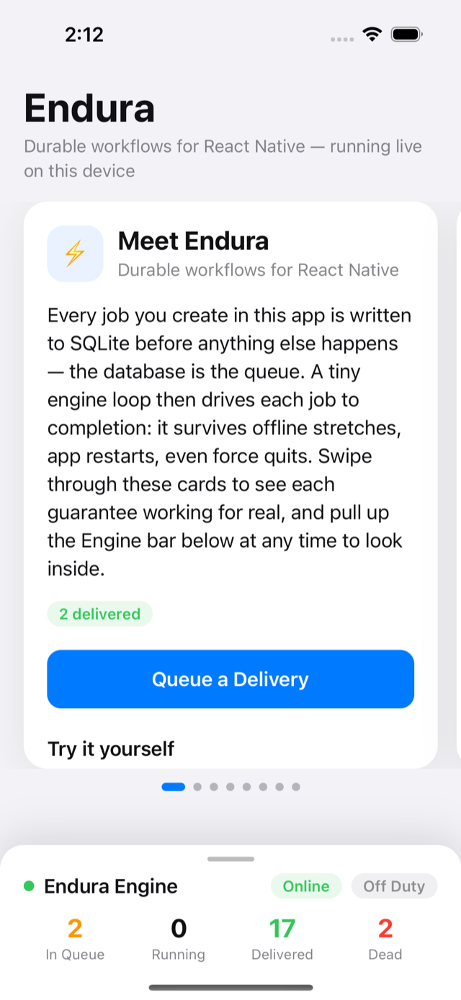
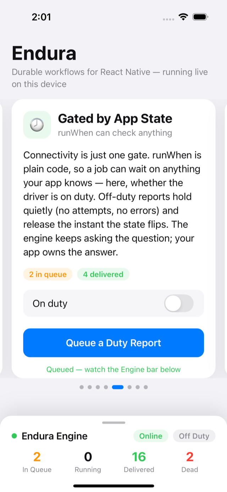
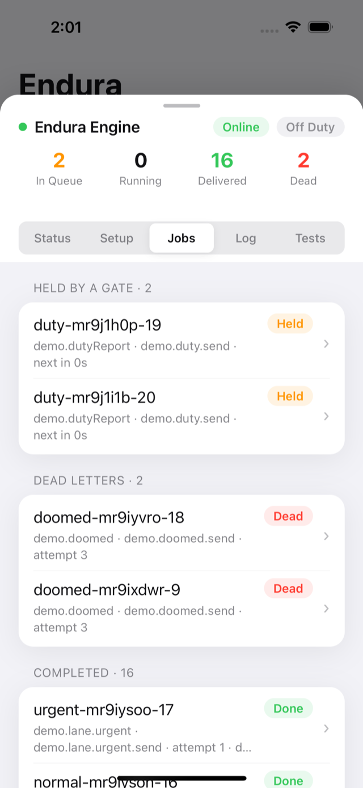
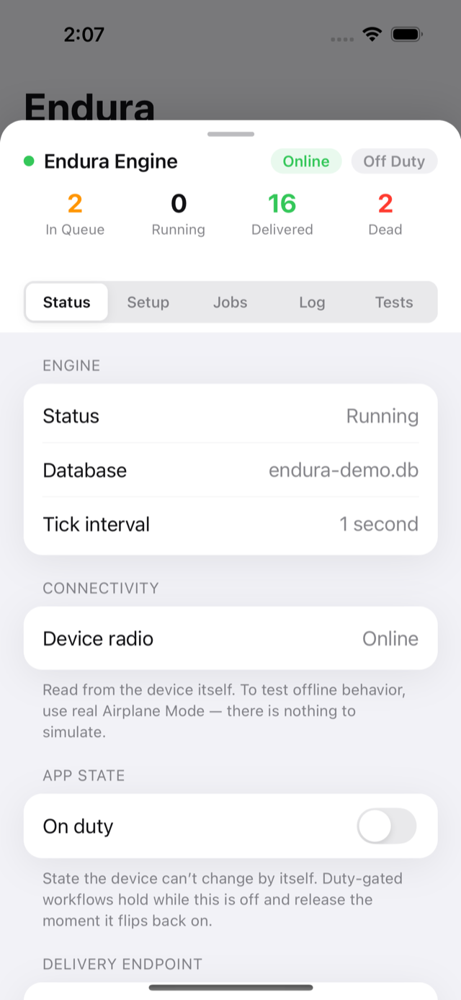
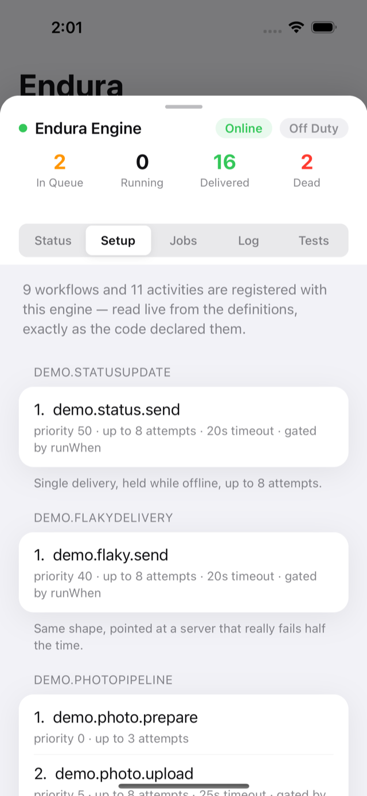
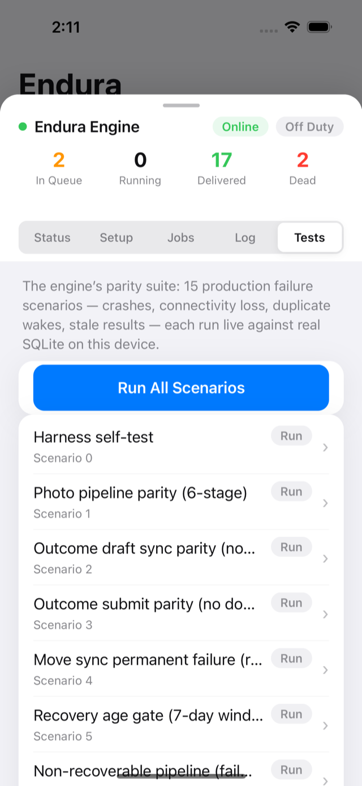

# Endura Example App

An Expo app that is both **documentation and evidence** for Endura. Everything
in it is real: real SQLite persistence, real HTTP deliveries to the real
internet, the device's real radio. Nothing that the phone can do itself is
simulated — you test offline behavior with actual Airplane Mode and durability
with an actual force quit.

<p align="center">
  
  
  
</p>

## The card deck

The main surface is a horizontally swipeable deck. Each card explains one
guarantee in plain English, shows the code that provides it, and has a button
that runs it for real:

1. **Meet Endura** — the whole idea in one screen; queue your first delivery.
2. **Survives Offline** — gated jobs hold (attempts frozen) in Airplane Mode
   and flush on reconnect. Force-quit mid-queue; nothing is lost.
3. **Retries, Automatically** — sends to an endpoint that genuinely returns
   HTTP 500 half the time; watch backoff absorb a misbehaving server.
4. **Multi-Step Pipelines** — prepare → upload → finalize; each stage's return
   value feeds the next, resumable between stages.
5. **Gated by App State** — `runWhen` is plain code, so jobs can wait on
   anything the app knows; the on-duty switch holds and releases duty reports.
6. **Priority Lanes** — queued backwards, delivered by priority.
7. **Exactly Once** — mash the button; `uniqueKey` dedupes at the database.
8. **When All Else Fails** — a doomed job burns 3 real attempts and lands in
   the dead-letter queue with its full history, ready for manual retry.

## The engine inspector

A status bar with live queue counters is docked at the bottom. Drag it up
(it's a standard bottom sheet — it follows your finger) for the full
inspector, with swipeable tabs:

- **Status** — engine state, the radio as the device reports it, the on-duty
  app-state switch, the delivery endpoint (paste a webhook.site URL to watch
  your phone's deliveries land on a laptop), queue counts, and reset.
- **Setup** — every registered workflow and activity with its priority, retry
  policy, timeout, and gating — read live from the definitions.
- **Jobs** — every job the engine persists, grouped by phase (running,
  retrying, held, waiting, dead, completed), with a drill-in detail view:
  payload, accumulated state, pipeline trail, task lease, and the verbatim
  error/hold history of every attempt. Dead letters can be retried; running
  jobs cancelled.
- **Log** — the engine narrating itself.
- **Tests** — the 15-scenario parity suite (crashes, connectivity loss,
  duplicate background wakes, stale results…), each run live against real
  SQLite on this device.

<p align="center">
  
  
  
</p>

## Running it

> **This branch needs a dev build, not Expo Go.** Activities now execute
> on a real worker thread via react-native-workers, which ships native
> code that Expo Go does not contain. Build a dev client once
> (`npx expo run:ios` / `run:android` or an EAS dev build) and iterate
> with Metro as usual from there.

### Quick start (dev build + dev server)

```bash
# from the repo root: build + pack endura, install into the app
npm run build && npm pack --pack-destination /tmp
cp /tmp/endura-0.1.0.tgz ./endura-0.1.0.tgz
cd examples/example-app
npm install
npx expo run:ios   # or: npx expo run:android — first time only
npx expo start     # subsequent iterations
```

This demos everything except one scenario: relaunching the app **while
still offline** (a dev bundle can't be re-fetched without a network).

### Full offline testing (publish to your own Expo account)

Airplane-mode + force-quit + relaunch needs the bundle cached on the device
instead of served by Metro. Publish it to your own (free) Expo account with
EAS Update — Expo Go then loads it from the CDN and relaunches it from cache,
no computer involved:

```bash
cd examples/example-app
npx eas-cli login              # your free expo.dev account
npx eas-cli init               # creates the project under YOUR account
npx eas-cli update:configure   # writes your updates.url into app.json
npx eas-cli update --branch demo --message "my field build"
```

Open the update once from the QR on your EAS dashboard. On this branch
the update must load into your **dev build** (Expo Go lacks the worker
native module); from then on it launches offline. Notes:

- `eas init` / `update:configure` write your personal `projectId`, `owner`,
  and `updates.url` into `app.json` — that's expected; don't commit them.
- Keep `runtimeVersion.policy` as `sdkVersion` — Expo Go can only load
  updates published with the SDK-version runtime.

## Why the parity suite matters

Scenarios never assert "the workflow completed". They assert on a **business
effect ledger** — one uploaded photo, one submitted outcome — recorded by a
scriptable fake server with server-side idempotency. At-least-once delivery is
only safe if retries never become duplicate business effects; the ledger is
where that claim gets tested.

## Provenance

This app is the Phase 4 gate from the production-readiness review
(`docs/reviews/production-readiness-review-2026-07-05.md`): driver-app pipeline
behaviors extracted from production, translated into deterministic scenarios,
passing on iOS and Android. The issue catalog it produced (including two real
engine bugs it caught and fixed) lives in `docs/phase4/issue-catalog.md`.
